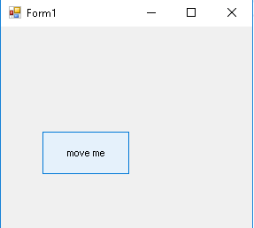

# Tricky-button
Just a program written in C# that allows a button to be moved anywhere inside a form using the mouse.

Just a little modification has to be done, but other than that it's running okay. If you run the program and don't see the button just maximize the window and you'll see it a little bit down.
